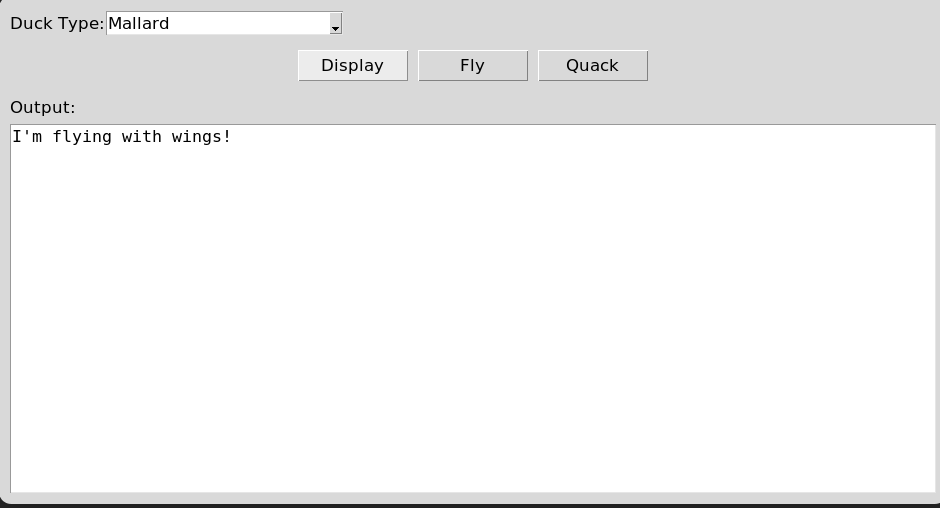

# 🦆 Duck Simulator App

[](https://www.python.org/downloads/)
[](LICENSE)
[](https://docs.python.org/3/library/tkinter.html)

A Python implementation of the Strategy Design Pattern using ducks as an example. This project is a port of a C# WPF application to Python using Tkinter.

## 🚀 Features

- 🦆 Multiple duck types (Mallard, Rubber, Rocket)
- 🔄 Dynamic behavior switching
- 🎮 Simple GUI interface
- 📚 Clean object-oriented design
- 🧩 Implementation of the Strategy Design Pattern

## 📋 Table of Contents

- [Installation](#-installation)
- [Usage](#-usage)
- [Project Structure](#-project-structure)
- [Design Pattern](#-design-pattern)
- [Screenshots](#-screenshots)
- [Contributing](#-contributing)
- [License](#-license)

## 📥 Installation

### Prerequisites

- Python 3.7 or higher
- Tkinter (usually comes with Python)

### Steps

1. Clone the repository:
   ```bash
   git clone https://github.com/yourusername/duck-simulator.git
   cd duck-simulator
   ```

2. No external dependencies are required beyond Python's standard library.

## �� Usage

Run the application:

```bash
python -m duckapp.main
```

### Interface

- **Duck Type Dropdown**: Select the type of duck
- **Display Button**: Show the duck's description
- **Fly Button**: Make the duck perform its flying behavior
- **Quack Button**: Make the duck perform its quacking behavior
- **Output Area**: View the results of duck actions

## 📁 Project Structure

```
duckapp/
├── __init__.py                 # Package marker
├── main.py                     # Main application entry point
├── behaviors/                  # Behavior-related classes
│   ├── __init__.py             # Package exports
│   ├── interfaces.py           # Abstract behavior interfaces
│   ├── fly_behaviors.py        # Concrete flying behaviors
│   ├── quack_behaviors.py      # Concrete quacking behaviors
├── ducks/                      # Duck-related classes
│   ├── __init__.py             # Package exports
│   ├── duck.py                 # Abstract Duck base class
│   ├── mallard_duck.py         # Mallard duck implementation
│   ├── rubber_duck.py          # Rubber duck implementation
│   ├── rocket_duck.py          # Rocket duck implementation
```

## 📐 Design Pattern

This application demonstrates the **Strategy Design Pattern**, which:

- 🔄 Defines a family of algorithms
- 💼 Encapsulates each algorithm
- 🔄 Makes them interchangeable
- 🛠️ Allows algorithms to vary independently from clients that use them

In this example:
- `Duck` is the context
- `IFlyBehavior` and `IQuackBehavior` are the strategy interfaces
- Concrete implementations like `FlyWithWings`, `FlyNoWay`, `Quack`, etc. are the strategies

## 📷 Screenshots

<!-- Add screenshots here when available -->


## 🔄 Class Diagram

```
┌───────────┐         ┌───────────────┐
│   Duck    │         │ IFlyBehavior  │
├───────────┤         ├───────────────┤
│flyBehavior├────────>│     fly()     │
│quackBehav.│         └───────┬───────┘
├───────────┤                 │
│display()  │         ┌───────┴───────┐
│performFly()│        │               │
│performQuack│ ┌──────┴─────┐ ┌──────┴─────┐
└───────────┘ │FlyWithWings │ │  FlyNoWay  │
     ▲        ├────────────┬┘ ├────────────┤
     │        │   fly()    │  │   fly()    │
┌────┴────┐   └────────────┘  └────────────┘
│         │
│    ┌────┴─────┐  ┌────┴─────┐  ┌────┴────┐
│    │MallardDuck│  │RubberDuck│  │RocketDuck│
│    ├───────────┤  ├──────────┤  ├─────────┤
│    │ display() │  │display() │  │display()│
└────┴───────────┘  └──────────┘  └─────────┘
         ┌───────────────┐
         │IQuackBehavior │
         ├───────────────┤
         │    quack()    │
         └────────┬──────┘
                  │
      ┌───────────┼───────────┐
      │           │           │
┌─────┴─────┐┌────┴─────┐┌────┴─────┐
│   Quack   ││  Squeak  ││ MuteQuack│
├───────────┤├──────────┤├──────────┤
│  quack()  ││ quack()  ││ quack()  │
└───────────┘└──────────┘└──────────┘
```

## 👥 Contributing

Contributions are welcome! Here's how you can contribute:

1. Fork the repository
2. Create a feature branch: `git checkout -b new-feature`
3. Commit your changes: `git commit -am 'Add some feature'`
4. Push to the branch: `git push origin new-feature`
5. Submit a pull request

## 📄 License

This project is licensed under the MIT License - see the LICENSE file for details.

## 🙏 Acknowledgements

- Head First Design Patterns for the original duck example
- Python and Tkinter documentation
